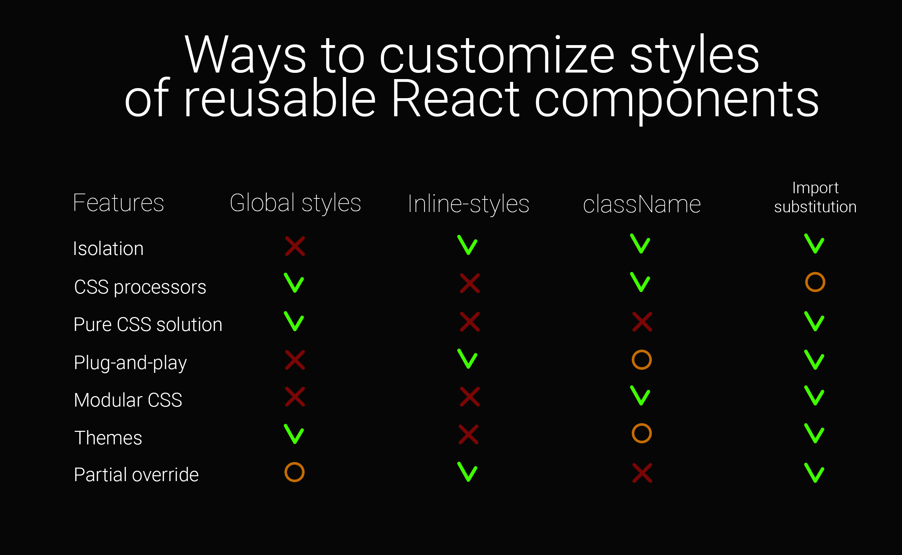

Import substitution (alfa)
==

Technique of customizing, which is based on import substitution.

# Theory

Es6 modules are not supports the dependencies injections. But we still can to substitute several parts of module at the assembly stage by customizing path resolver. If target module requires file or package, it can be substituted to something else.

Operating variables
---

The process of resolving a path depends on the several values. These values are basic in the process of matching the case and forming a path.

### `request`
Is the string that user specified in quotation marks. For example:
```js
import './bar.js';
```
Where `./bar.js` is our **request**.

It can be matched by regular expression `\/bar\.js$/`.

---

### `base`
The directory from which the request is made. For example:

*The file `src/foo/index.js` requires `./bar.js`.*

Where `src/foo` is our **base**.

It can be strict matched by regular expression `src\/foo`;

---

### `basename` (placeholder)
if `src/foo` is **base**, then `foo` is **basename**.

---

### `root` (placeholder)
The root directory of the project. In typical cases `root` is `process.cwd()`, but can be specified in options.

---

### `id` (placeholder)
Requested filename. If `request` is `./bar.js`, then `id` is `bar.js`.

## Rules

The replacement rule is shaped from two regular expressions for `request` and `base`, wrapped to `match` property and one path-determining property - `use`, which contains new `request` and/or `base`.

```js
{
  match: {
    request: RegEx,
    base: RegEx
  },
  use: {
    request: string,
    base: string
  }
}
```

By matching two values (`request` and `base`) you can determine exactly what file is requested and where from, and the concrete case of the customization.

If `request` and `base` are matched to defined value by engine, then instead of origin `request` and `base` it will use same properties from property `use`.

## Options

### `originalResolve`

The path resolver of the native engine. By the default it is `path.resolve`. Keep property default if you are use the import-sub as standalone module.

### `resolve`

Custom resolve function, which will be called with resolved path.

### `root`
The project root. By the default it is `process.cwd()`.

### `request`*

User request.

### `base`*

The directory from which the request is made.

### Examples:

We need to substitute required file `./bar.js` from `src/foo` to `../../custom/foo/bar.js`.

```js
{
  match: {
    request: /\.\/bar\.js$/,
    base: /src\/foo$/
  },
  use: {
    request: '../../custom/foo/bar.js'
  },
}
```

Another way. Using custom `base`.

```js
{
  match: {
    request: /\.\/bar\.js$/,
    base: /src\/foo$/
  },
  use: {
    base: '<root>/custom/foo'
  },
}
```
---

Same situation, but for all modules in `src` folder.

```js
{
  match: {
    request: /\.\/bar\.js$/,
    base: /src\/[^\/]$/
  },
  use: {
    request: '../../custom/<basename>/bar.js',
  },
}
```
Here we use the placeholder `<basename>`, which in this case will have value `foo`.

---

Replace all `.js` to `.jsx`.

```js
{
  match: {
    request: /\.js$/
  },
  use: {
    request: /\.jsx$/
  }
}
```

### Custom placeholders

For more flexible compilation of the path, you can determine the placeholders by yourself. To do that use round brackets in regular expression.

```js
{
  match: {
    request: /\.\/([\w])\.js$/i
  },
  ...
}
```

Then the custom placeholder will get the hash `<request:1>`. If there were more groups, then they would be hashed with the index number `<request:2>`, `<request:3>`, etc.

```js
{
  ...,
  use: {
    request: './<request:0>.jsx'
  }
}
```

You probably already guessed that such capturing groups in the `base` will create the placeholders `<base:1>`, `<base:2>`, etc.

#### Use function

You are allowed to define property `use` as a function. In this case, you may implement the custom logic of path generation.

```js
{
  match: {
    request: /theme\.css$/i
  },
  use: (data) => {
    return path.join(data.base, 'themes/default.css')
  },
}
```

The function accepts an object with comprehensive information about the requested file.

```js
{
  use: ({
    root, // Project root
    base: // Base path
    id, // User request
    basename, // Name of folder, file required from
  }) => {}
}
```

Also, it contains all matched regex patterns if you have passed them to `request` or `base`.

# Benefits

In the field of customization of styles, the method provides a whole set of advantages.



# Features

## 1.1.0
- Support property `use` to be a function
- Accept rules as object, not only array
- Support multiple results, builded by function `use`

# Author

Vladimir Kalmykov

<vladimirmorulus@gmail.com>

https://morulus.github.io/

# Implementations

- [postcss-import-sub](https://github.com/morulus/postcss-import-sub) (Deprecated)
- [postcss-import-sub](https://github.com/morulus/postcss-redirect-import)
- [webpack-import-sub-plugin](https://github.com/morulus/webpack-import-sub-plugin)
